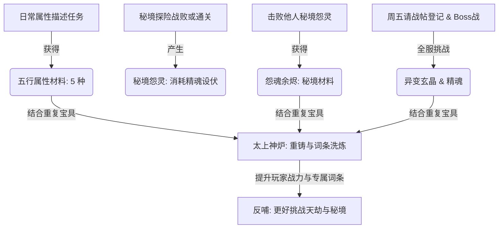

# 《天地异变：怨灵重世》限时事件系统策划书 (修改版)

此方案旨在通过一个统一的“天地异变”江湖故事，将**日常属性悬赏（文案契合属性并定向掉落材料）**、**秘境残影（怨灵设伏）**、**周五限时世界大 Boss（魔尊降临）**、以及**太上神炉（可变宝具熔炼与定向词条洗炼）**四大玩法有机且深度地串联在一起，构建一个完整的“日常积攒 -> 周末爆发 -> 属性沉淀与消耗”的闭环经济玩法体系。

---

## Ⅰ. 玩法闭环与故事背景

### 1. 故事背景
中原武林灵气突然紊乱，怨气自地脉滋生，世间发生剧烈异象。
* 盘踞在**秘境（琅嬛福地）**深处的历代修仙者骸骨，在吸纳了地脉怨气后，变异为了暴虐的**“神魂怨灵”**（即残影怨灵化），专门坑杀后来探秘的武林同道。
* 异象的源头——**“太古怨灵魔尊”**，在每周五的特定时段会撕裂虚空强行降临世间。
* 玩家日常的悬赏揭榜与江湖奇遇，日常任务的**文字任务描述将与特定属性及产出的 5 种奇异材料深度契合**，完成后定向获得散落的**“五行属性材料”**（无属性硬卡死限制）。
* 唯有通过太上炼器炉，结合日常碎屑和魔尊身上掉落的**“异变玄晶”**，方可将过剩的宝具熔炼重铸（消耗50银两），甚至洗炼出“辟邪、破魔、眩晕、或毒性”词条以抵御天劫。

### 2. 核心玩法闭环


---

## Ⅱ. 核心资源：【武道精魂】（纯活跃产出与精力管控）

为了杜绝“躺平白嫖”，精魂**取消每日零点自动赠送/重置机制**，完全转由玩家日常江湖活跃行为产出，以极大拉动日常玩法粘度，使精魂成为游戏黑市的绝对硬通货。
* **存储上限**：玩家最多可同时储存 **200 点精魂**。
* **购买溢出防护**：精魂上限为 200 点，但在黑市竞拍竞得“精魂简帖”时，允许超出上限（如临时增加至 250 点）。溢出后，日常任务与奇遇将不再产出精魂，直至消耗低于 200。

### 1. 精魂产出渠道
* **老玩家初始化福利**：新资料片上线后，老玩家以及新注册角色首次登录默认赠送 **100 点精魂** 作为初始活跃资金，无需从0肝起。
* **每日悬赏揭榜 (TaskHall)**：每进行一次悬赏任务，根据任务星级产出：
  * **成功通关**：`1星` 任务：2点精魂 | `2星`：4点 | `3星`：6点 | `4星`：8点 | `5星`：10点。
  * **失败保底**：给予 **50% 的精魂回报**（向上取整，如5星任务失败可得5点精魂），确保低属性玩家不会因任务连续失败而无法获取精魂。
* **江湖奇遇连战 (EncounterArena)**：每战胜一个波次（3名对手），奖励 **5点精魂**（通关 60 人共可满载赚取 100 点精魂）。
* **秘境探险发掘 (SecretRealm)**：在下潜遭遇的随机选择分支中，有一定几率发掘到“灵气法阵/精魂飞瀑”，直接提取 **5~10 点精魂**。
* **黑市拍卖 (Auction)**：精魂可打包为“精魂简帖”（50点/帖）上架交易。

### 2. 精魂消耗途径
* **挑战周五大 Boss**：每次挑战消耗 **10 点精魂**。
* **秘境主动设伏怨灵**：每次消耗 **20 点精魂**。
* **神兵熔炉重铸**：每次消耗 **15 点精魂**。
* **器灵词条洗炼**：每次消耗 **25 点精魂**。

---

## Ⅲ. 日常任务重构：5 种奇异材料与属性关联

日常悬赏任务面板中，任务描述文字将与其对应的属性训练和定向掉落的 5 种属性材料深度融合：

| 奇异材料 | 材料属性 | 契合属性门槛（文案描述展示） | 定向悬赏任务文字描述样例 | 熔炉用途（洗炼指定器灵词条） |
| :--- | :--- | :--- | :--- | :--- |
| **金精砂** | 锐金 | 力量 `str` &ge; 40 | `【力量悬赏】协助铁匠铺锻造百炼寒铁，锤击千次以提炼金精砂。` | 洗出 **力量 (str)、真实伤害、破防率**，或 **眩晕词条 (击晕率10%)** |
| **乙木芝** | 柔木 | 体质 `con` &ge; 40 | `【体质悬赏】跋涉险峰采集野生灵芝，锤炼肉身筋骨，奖励乙木芝。` | 洗出 **体质 (con)、最大生命值、减伤** |
| **玄水液** | 弱水 | 敏捷 `agi` &ge; 40 | `【轻功悬赏】运用踏雪无痕身法限时飞鸽传书，凌空取回玄水液。` | 洗出 **敏捷 (agi)、闪避率、反弹伤害** |
| **地火髓** | 烈火 | 智慧 `int` &ge; 40 | `【智慧悬赏】在烈火静室中静坐参禅参悟武学奥义，获赠地火髓。` | 洗出 **智慧 (int)、破招率、暴击率**，或 **毒性词条 (中毒率15%)** |
| **厚土精** | 磐土 | 幸运 `luk` &ge; 40 | `【幸运悬赏】为遭遇天灾的百姓解签布施积德行善，偶得厚土精。` | 洗出 **幸运 (luk)、防晕免控、免伤率** |

---

## Ⅳ. 系统 1：秘境怨灵（宿命残影主动化）

* **主动设伏**：在秘境挑战失败死亡或通关时，玩家可选择 **消耗 20 点精魂** 开启神魂剥离，将自己当前的属性、技能与已装配秘宝镜像留存在该层，并可写下“怨怨相报”的遗言。
* **拉取与遭遇机制（前后端连通）**：
  * 当玩家进入秘境探索时，前端通过 Socket 发送 `get_realm_ghosts` 请求拉取当前层数段（如 $depth \pm 3$ 层内）的其他玩家怨灵。
  * 前端将这些怨灵以“怨灵拦路”随机事件的形式打乱混入探索事件卡组（Event Deck）中。
* **神魂对决（战斗逻辑）**：
  * 遭遇怨灵时，页面弹窗拉起“神魂对决”轻量战斗面板，双方基于属性与技能自动进行最多 20 回合的博弈。
  * **战胜**：获得 **2~3 个“怨魂余烬”**，并可在当前层留碑纪功。
  * **战败**：扣除生命值并被强行退出秘境，同时触发后端发送 `ghost_win_dividend`，将 **2 银两** 作为分红打入设伏怨灵作者的账户中。
* **消散机制**：成功坑杀 1 人或存活 24 小时后自动消散，防止双号互刷。

---

## Ⅴ. 系统 2：周五世界大 Boss —— 【太古噬魂魔罗】

为了带给全服玩家紧张刺激的史诗合作感，特针对周五限时降临的世界 Boss 进行全方位细节设定：

### 1. 降临法则与请战帖自适应血槽
* **活动时间**：**每周五晚上 19:00 至 24:00**。
* **【请战帖】报名机制**：
  * 从周四中午 **12:00 至周五晚上 19:00** 为请战报名阶段。
  * 玩家可在“世界 Boss 大厅”点击“投递请战帖”进行参战登记（不消耗精魂，只作为参战意向确认）。
* **自适应血量计算**：
  * 晚上 19:00 Boss 正式降临，其最大 HP 严格根据已投递“请战帖”的不重复玩家数量 $N_{\text{active}}$ 动态决定：
    $$\text{Boss HP} = \text{基础血量}(500,000) + N_{\text{active}} \times 800,000$$
  * *算例*：若有 3 名玩家投递了请战帖，则 Boss HP 为：$500,000 + 3 \times 800,000 = 2,900,000$（290万）。即使有人中途下线，剩余玩家每人挑战几次（单次伤害约 10w~40w）也能顺利合力击杀。
  * **中途参战保护**：未在 19:00 前报名请战的玩家，在活动期间（19:00 - 24:00）依然可以中途加入挑战，但**不会再增加 Boss 的血量上限**，以防恶意刷血。
* **挑战准入**：单次挑战消耗 **10 点精魂**。

### 2. 世界 Boss 专属战斗技能
魔罗拥有独立的技能释放轴线：
* **【魔罗乱神】（第 3、8 回合释放）**：对玩家施加“心魔干扰”：使玩家在接下来的 2 个回合内，所有已装备功法的触发几率强制降低 **30%**。
* **【邪煞夺魄】（第 5, 12 回合释放）**：对玩家造成重击并 50% 几率施加 2 回合魔毒（扣最大血量 8%/回合，持续 2 回合）；同时 Boss 开启“血魂护盾”：本回合反弹玩家对其输出的 **20% 伤害**。
* **【太古魔啸】（第 7, 14 回合释放）**：Boss 爆发大范围风暴，有 **35% 几率将玩家击晕 1 回合**。若玩家有带有 `【防晕免控】` 的器灵词条或宝具，则可直接免疫。
* **【诸神寂灭】（第 15 回合强制释放）**：Boss 释放灭世魔雷，对玩家造成 `99,999` 点毁灭性真实伤害，强制结束单局模拟，上传累计伤害。

### 3. 世界 Boss 战斗判定与词条克制
* **九重邪光护体（破魔词条克制）**：Boss 默认自带 **80% 的高额免伤率**。玩家宝具上洗炼的 `【破魔】` 词条可无视该防护。
* **神魔威压（抗性机制）**：Boss **免疫绝对眩晕控制**。触发“击晕”时，转化为**“破招威压”**：使 Boss 本回合输出伤害骤降 **50%**。
* **邪煞反噬（中毒流血公式差异化）**：
  * **对世界 Boss (PVE)**：Boss 不吃百分比扣血，中毒时每回合损失 `玩家智慧 (int) * 中毒等阶 * 15` 点固定气血（以高额固定流血破其防御）。
  * **对普通玩家 (PVP)**：中毒时每回合扣除 `(玩家智慧 * 中毒等阶 * 2) + 目标最大HP * 1.5%` 的血量（避免直接秒杀玩家，维持PVP博弈长度）。

### 4. 实时并肩作战设计（防拥堵与小服适配重构）
* **【并肩出招日志插播与流控机制】**：
  * **什么是日志栏**：指玩家在战斗中实时滚出的文字对招明细面板（Battle Logs Panel）。
  * **高光过滤**：唯有当其他战友打出**暴击伤害**、**使用绝学大招**、或**单次输出伤害超过 30,000 点**时，才向本战场推送日志。
  * **限流削峰**：前端设置流闸，每 2 秒最多插播 1 条高光日志。若瞬间收到多个广播，只取伤害最高者。
  * **内存限长**：日志栏最大存储 50 条消息，超出时头部自动 `shift()` 弹出，彻底消除 DOM 溢出卡死。
* **【同道大殿看板】（名字 + 血条 + 挑战次数）**：
  * 右侧“并肩御敌”栏重构为**高度扁平的紧凑列表**：`【名字】 + 【横向百分比小血条】 + 【今日第 N 次挑战】`。
  * **首屏限额 5 人**：列表仅展示当前战场中血量最低或输出伤害最高的 5 名最活跃战友。其余战友合并为底端一行小字。
* **【水墨风剑意微粒与高光Toast】（轻量视觉表现）**：
  * **水墨刀光背景拂过**：背景层以 0.5 秒的速度滑过一道**极淡的黑色水墨刀影**，伴随极速微粒。
  * **大招高光 Toast 弹窗**：在玩家屏幕中上方淡入淡出（fade in/out）漂浮显示一个精致的金色半透明气泡通知，并在 2 秒后自动消散，且同一时间只允许存在 1 个。

### 5. 奖励分配与【全服世界拍卖分红 & 系统兜底机制】
* **保底挑战奖**：每次挑战不论伤害多少，单局保底从 Boss 身上搜刮出 2~3 个 **“异象碎屑”**。
* **最后一击（Last Hit）**：击杀者获得专属称号 **“渡劫天尊”**。
* **【全服拍卖及系统兜底分红】**：
  * Boss 被击杀后，爆出 1 件**神话本命宝物**，并在周五晚上 23:00 - 24:00 强制启动该宝物的公开竞拍。
  * **系统回购兜底**：若拍卖会截止时无人出价（流拍），**系统黑市商会会以 100 银两的保底回收价强制回购该神物**。
  * **分红发放**：最终竞拍所得的银两，在扣除 10% 后，**其余 90% 银两全部作为世界 Boss 累计伤害的百分比比例，直接分红给所有参与过挑战的玩家**。

---

## Ⅵ. 系统 3：太上神兵熔炉（重铸与洗炼公式）

### 1. 可变重铸（三合一）配方
* **配方**：`投入的同品质秘宝` + `10 个“异象碎屑”` + `15 点精魂` + `金/木/水/火/土随机材料各 1 个` + `50 银两`。
* **新规则与避同机制**：
  * **避同机制**：重铸生成的新宝具，**绝对不会与本次投入重铸的任何一件宝具 ID 相同**。
  * **可变投入升阶率**：
    * 投入 **3** 件同品质秘宝：重铸升阶率为 **35%**；
    * 投入 **4** 件同品质秘宝：重铸升阶率为 **65%**；
    * 投入 **5** 件同品质秘宝：重铸升阶率为 **100% (必定成功进阶！)**。

### 2. 器灵洗炼与强度可控
* **条件**：仅针对“史诗”及以上品质的本命宝具。
* **配方**：`主洗炼宝具` + `消耗1件【史诗】或以上品质的任意副宝具 (作为熔炼器胚耗材，不限主宝具阶级)` + `25 点精魂` + `1 个“异变玄晶”` + `5 个“怨魂余烬”` + `投入的指定属性奇异材料 (5/10/20 个)`。
* **强度自选机制**：洗出的器灵词条的附加属性数值强度，严格取决于投入的奇异材料数量：
  * 投入 **5** 个属性材料：洗出 `I 阶属性`（如：力量 +5，或 击晕率 3%，中毒概率 5%）；
  * 投入 **10** 个属性材料：洗出 `II 阶属性`（如：力量 +10，或 击晕率 6%，中毒概率 10%）；
  * 投入 **20** 个属性材料：洗出 `III 阶（满级）属性`（如：力量 +15，或 击晕率 10%，中毒概率 15%）。

---

## Ⅶ. 落地开发数据表设计

### 1. 玩家数据结构（player）增加字段：
```json
{
  "essence": 0,             // 当前精魂值 (上限200，初始100)
  "inventoryMaterials": {
    "anomalyDust": 0,       // 异象碎屑 (日常/奇遇掉落)
    "soulAshes": 0,         // 怨魂余烬 (秘境打败怨灵掉落)
    "anomalyCrystal": 0,    // 异象玄晶 (周五世界Boss掉落)
    "goldSand": 0,          // 金精砂 (金)
    "woodHerb": 0,          // 乙木芝 (木)
    "waterFluid": 0,        // 玄水液 (水)
    "fireMarrow": 0,        // 地火髓 (火)
    "earthEssence": 0       // 厚土精 (土)
  },
  "equippedTreasureAttrs": { // 熔炼洗出的额外附加词条
    "extraStr": 0,           // 附加力量 (I阶:+5, II阶:+10, III阶:+15)
    "extraCon": 0,           // 附加体质
    "extraAgi": 0,           // 附加敏捷
    "extraInt": 0,           // 附加智慧
    "extraLuk": 0,           // 附加幸运
    "extraDodge": 0,         // 额外闪避 (I阶:+2%, II阶:+4%, III阶:+6%)
    "extraDef": 0,           // 额外减伤
    "stunRate": 0,           // 额外击晕概率 (I阶:3%, II阶:6%, III阶:10%)
    "poisonRate": 0          // 额外中毒概率 (I阶:5%, II阶:10%, III阶:15%)
  }
}
```

### 2. 服务端数据库（db.json）新增怨灵数据表与请战帖数据：
```json
"secret_realm_ghosts": [
  {
    "id": "ghost_1717584100",
    "creatorName": "猫十一郎",
    "layerIndex": 12,
    "attributes": { "con": 35, "str": 5, "int": 4, "agi": 90, "luk": 5 },
    "skills": ["s1", "s3", "s5", "s_dugu"],
    "equippedTreasure": "t9",
    "ghostHpPercent": 0.8,
    "message": "左边的路有危险，道友千万别去！",
    "killCount": 0
  }
],
"world_boss_signups": [
  "猫十一郎",
  "张无忌"
]
```
